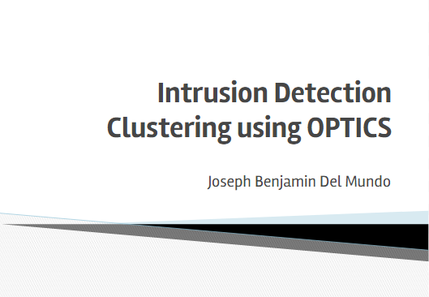

Intrusion Detection System
========

Presentation slides available at: https://docs.google.com/presentation/d/1jC_iELqeLAMPgcSU3Fv90J83jE3EctBST-YP-W1i3gI/edit?usp=sharing

New types and variations of computer intrusions develop everyday and intrusion detection systems (IDS) face the challenge of having not enough information about them. We believe that we can still detect new intrusions by using the existing information about the currently known intrusions and the normal system behaviors.

We use clustering, a data mining technique to group incoming network packets with the system's knowledge base. The knowledge base contains packets from the authorized connections as well as packets from known intrusions.

We choose OPTICS clustering to group the packets together. We decide whether the incoming packet is an intrusion or not based on the cluster it falls into. We also aim to increase detection rates of the current known intrusions. We also compare detection rates if information about the known intrusions are presented to IDS. This can help identify new and novel intrusions that are not present in the system. We determine whether these information about the intrusions are signifcant or not.